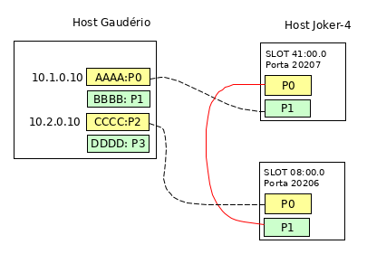

# Aplicação basica 
Aqui vai um descritivo sobre o que faz

## Topologia

A  apresenta a topologia sobre a qual foram realizados
os testes, sendo que as placas do host gaudério estavam com uma plada de 40 Gb com 2
interfaces físicas, as quais foram configuradas para funcionar como um cabo breackout
que permite a divisão de uma interface de 40Gb em 4 interfaces de 10 Gb. Assim, nesta
figura está representado comente as 4 interfaces do cab

# Uso

## Carregamento dos drivers
Realizar o carregamento do driver e das configurações na smartinics.
Considerando a topologia básica utilizada nos testes, os drivers são
carregados no Joker-4. 
```
rtecli -p 20206 design-load -f basicDriver.nffw -c basicConfig.p4cfg
rtecli -p 20207 design-load -f basicDriver.nffw -c basicConfig.p4cfg 
```
ou com o script desenvolvido para gerenciar estas ações
```
nfp-config.sh nl basicDriver.nffw basicConfig.p4cfg
```

## Configuração das interfaces
Nos testes realizados, estas configurações foram realizadas no servidor
Gauderio.

### Uso com driver NFP 
1. Verificar se as interfaces estão configuradas para uso com o driver da
Netronome e não para o dpdk.

2. Alterar para driver da netronome caso esteja para DPDK.

3. Configurar rede conforme topologia.
```
ip addr add 10.1.0.10/24 dev enp3s0np0s0
ip addr add 10.2.0.10/24 dev enp3s0np0s2
ip addr show
```

4. Verificar as informações de rede no scrip scripts/run.py.
* Origen
** ETH_SRC : nome da interface de origem 
** IP_SRC : IP configurado na interface de origem
* Destino
** ETH_DST : nome da interface de destino
** IP_DST : IP configurado na interface de destino.

5. Executar './run.py s [n]' para enviar e 'run.py rt' para receber.

### Uso com driver DPDK
1. Verificar se as interfaces estão configuradas para uso com o driver do DPDK e
altera caso não esteja.

2. Acessar o diretório do MoonGen e executar o script desejado.
* Ex: script da netronome
```
./build/MoonGen ./examples/netronome-packetgen/packetgen.lua -tx 0 -rx 2 --dst-ip 10.2.0.10 --dst-ip-vary 0.0.0.0 
./build/MoonGen ./examples/netronome-packetgen/packetgen.lua --help
```
* Ex: script de latencia 
```
./build/MoonGen ./examples/l3-load-latency.lua 0 2
./build/MoonGen ./examples/l3-load-latency.lua --help

```

```

