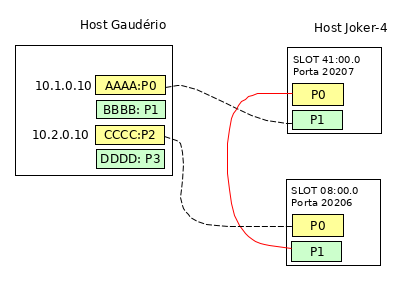

# Aplicação rcontReg 
Exemplo de implementação de contadores e registradores utilizando SmartNics da 
netronome e linguagem P4, considerando a [topologia básica](/README.md) para execução.

É criado um contador de pacotes e um registrador de 64 bits com duas posições, ambos 
no `egress`. O contador utiliza a porta de entrada e saída do pacote como índice para 
incrementar a contagem e esse contador reflete no contador obtido no ambiente, através 
do comando `rtecli`. 

Os contadores não pode ser recuperados pelo P4, para essa tarefa devem ser utilizados os
registradores. No exemplo é criado um registrador com duas posições de 64 bits cada 
_registre<bit<64>>(2) nome;_, sendo lido e atualizado a cada execução do `egress`.

## Topologia

A  apresenta a topologia sobre a qual foram realizados
os testes, sendo que as placas do host gaudério estavam com uma plada de 40 Gb com 2
interfaces físicas, as quais foram configuradas para funcionar como um cabo breackout
que permite a divisão de uma interface de 40Gb em 4 interfaces de 10 Gb. Assim, nesta
figura está representado comente as 4 interfaces do cab

# Utilização

## Carregar o driver
Realizar o carregamento do driver e das configurações nas SmartNics.

```
rtecli -p 20206 design-load -f confRegDriver.nffw -c confRegConfig.p4cfg
rtecli -p 20207 design-load -f confRegDriver.nffw -c confRegConfig.p4cfg 
```
ou com o script desenvolvido para gerenciar estas ações
```
nfp-config.sh nl confRegDriver.nffw confRegConfi.p4cfg
```

## Interfaces e script 
1. Verificar se as interfaces estão configuradas para uso com o driver da Netronome 
e não para o dpdk, executando `nfp-dpdk-mg.sh ns`

2. Alterar para driver da netronome caso esteja para DPDK, executanto 
`nfp-dpdk-mg.sh nfp [XX:XX.X]`

3. Configurar rede conforme topologia.
```
ip addr add 10.1.0.10/24 dev enp3s0np0s0
ip addr add 10.2.0.10/24 dev enp3s0np0s2
ip addr show
```

4. Verificar as informações de rede no script `scripts/run.py`.
* Origen
    * ETH_SRC : nome da interface de origem 
    * IP_SRC : IP configurado na interface de origem
* Destino
    * ETH_DST : nome da interface de destino
    * IP_DST : IP configurado na interface de destino.

## Executar
Executar `./run.py s [opção]` para enviar ou receber pacotes

a) Envio de pacotes: `./run.py s [n]`.
Envia um pacote utilizando a biblioteca scapy, tendo como base o endereço IP e o
endereço MAC. O endereço MAC é obtido do nome da interface, sendo que não é necessária 
a sua utilização. Caso não seja passado nenhum valor após o parametro 's', serão 
realizados 5 envios.

b) Recebimento de pacotes: `./reg.sh [c|r|clear]`.

* `./reg.sh c`: exibe os valores dos contadores nas portas de entrada e saida de cada placa. 
* `./reg.py r [n]`: exibe os valores do registrador a cada n segundos. Por padrão n=0.
* `./reg.sh clear`: limpa os valores dos registradores e contadores.


## Verificação

A cada execução de envio com 5 repetições, todos os valores foram incrementados em 5
demonstrando que em ambos os casos estão corretos.

OBS: caso não seja definida uma regra drop no arquivo de configuração, o número de pacotes em 
alguns marcadores será diferente do enviado pelo script.
