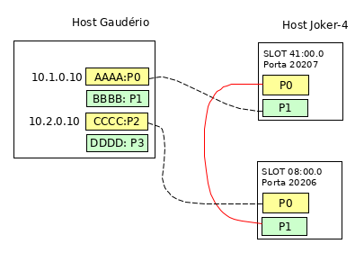

# Aplicação recircular 
Exemplo de implementação de recirculação utilizando SmartNics da netronome
e linguagem P4, considerando a [topologia básica](/README.md) para execução.


## Topologia

A  apresenta a topologia sobre a qual foram realizados
os testes, sendo que as placas do host gaudério estavam com uma plada de 40 Gb com 2
interfaces físicas, as quais foram configuradas para funcionar como um cabo breackout
que permite a divisão de uma interface de 40Gb em 4 interfaces de 10 Gb. Assim, nesta
figura está representado comente as 4 interfaces do cab

# Utilização

## Arquivo de configuração
O arquivo de configuração  possui um campo `num_r` que corresponde ao número 
de recirculações que serão realizadas caso ocorra um _match_ com a regra. 
Caso esse valor seja zero, nenhuma recirculação será executada. Para valores
diferentes de zero, são executadas N recirculações em cada placa. Por exemplo, 
no ambiente testado, onde uma comunicação passa por duas placas, para `num_r=5` 
serão realizadas 10 recirculações, 5 em cada placa.

```
"num_r": {
    "value": "0"
}
```

## Carregar o driver
Realizar o carregamento do driver e das configurações nas SmartNics.

```
rtecli -p 20206 design-load -f recircular.nffw -c recircularConfig.p4cfg
rtecli -p 20207 design-load -f recircular.nffw -c recircularConfig.p4cfg 
```
ou com o script desenvolvido para gerenciar estas ações
```
nfp-config.sh nl recircularDriver.nffw recircularConfig.p4cfg
```

## Interfaces e script 
1. Verificar se as interfaces estão configuradas para uso com o driver da
Netronome e não para o dpdk, executando `nfp-dpdk-mg.sh ns`

2. Alterar para driver da netronome caso esteja para DPDK, executanto 
`nfp-dpdk-mg.sh nfp [XX:XX.X]`

3. Configurar rede conforme topologia.
```
ip addr add 10.1.0.10/24 dev enp3s0np0s0
ip addr add 10.2.0.10/24 dev enp3s0np0s2
ip addr show
```

4. Verificar as informações de rede no script `scripts/run.py`.
* Origen
    * ETH_SRC : nome da interface de origem 
    * IP_SRC : IP configurado na interface de origem
* Destino
    * ETH_DST : nome da interface de destino
    * IP_DST : IP configurado na interface de destino.

## Executar
Executar `./run.py s [opção]` para enviar ou receber pacotes

a) Envio de pacotes: `./run.py s [n]`.
Envia um pacote utilizando a biblioteca scapy, tendo como
base o endereço IP e o endereço MAC. O endereço MAC é obtido do nome da
interface. 

Nos testes realizados, a recirculação ocorreu tanto com o MAC adicionado no 
arquivo de configuração, como somente com o IP configurado.  Caso não seja passado 
nenhum valor após o parametro 's', serão realizados 5 envios.

b) Recebimento de pacotes: `./run.py [rt|rs]`.

* `./run.py rt`: recebe pacores via tcpdum. A saída abaixo mostra um pacote que teve 10
iterações. Um pacote sem nenhuma iteração seria o campo tos=0x0 e ttl=62 

```
18:43:43.637017 IP (tos 0x14, ttl 52, id 1, offset 0, flags [none], proto ICMP
(1), length 28)
 10.1.0.10 > 10.2.0.10: ICMP echo request, id 0, seq 0, length 8
  0x0000:  0015 4d13 7ea8 0015 4d13 7ea8 0800 4514  ..M.~...M.~...E.
  0x0010:  001c 0001 0000 2a01 7cb6 0a01 000a 0a02  ......*.|.......
  0x0020:  000a 0800 f7ff 0000 0000 0000 0000 0000  ................
  0x0030:  0000 0000 0000 0000 0000 0000            ............
```
* `./run.py rs`: recebe os pacotes via biblioteca scapy, exibindo toda a extrutura
do pacote recebido. A saida abaixo mostra o campo tos=0x14 (20), setado quando o 
pacote finaliza a recirculação e o ttl=52, informado 10 recirculações.

```
###[ Ethernet ]### 
  dst       = 00:00:00:00:00:00
  src       = 00:00:00:00:00:00
  type      = IPv4
###[ IP ]### 
  version   = 4
  ihl       = 5
  tos       = 0x14
  len       = 28
  ......
  ttl       = 52
  proto     = icmp
  ......
  \options   \
###[ ICMP ]### 
  type      = echo-request
  ......
###[ Padding ]### 
  load      = '\x00\x00\x00\x00\x00\x00\x00\x00\x00\x00\x00\x00\x00\x00\x00\x00\x00\x00'
```

### Verificar recirculação

A recirculação foi verificada comparando os valores do ttl e tos das saidas com a quantidade 
de recirculações que foi indicada em cada interface. Se as mesmas regras forem carregadas 
em ambas as interface, o número de recirculações por pacote será o dobro do valor configurado na
lista de regras, pois ele executa a quantidade definida em `num_r`, nas duas placas. 

Nas saídas apresentadas, foram contabilizadas 10 recirculações (ttl=52), sendo 5 em cada interface,
conferindo com o resultado esperado, visto que `num_r=5`.

A verificação por contadores (TX/RX) não é aplicada visto que as recirculações ocorrem internamente
a interface, não sendo registrada como transferência ou recebimento de pacotes.
