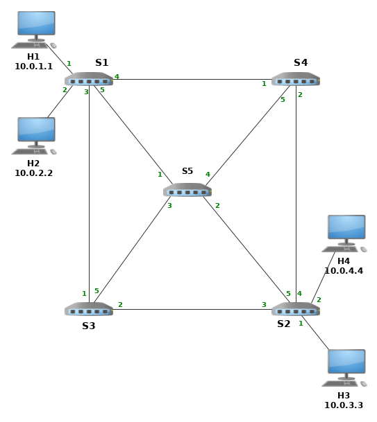

# Adaptação do exercício Link Monitoring do tutorial do p4lang 

## Introdução

O programa original percoria toda a rede indo e voltando até o host de origem,
coletando a mesma informação em todos os nós. Com as alterações realizadas,
distintsas informações podem ser obtidas em cada nó, sendo a informações
desejada, definidas juntamente com os nós a serem percorridos.

A topologia foi alterada, sendo adicionado um quinto switche, conectado com os
demais e também foram ajsutadas as portas de cada conexão. Veja 


## O pacote probe

O pacote original foi modificado para salvar uma informações genérica em um
campo de 48 bits, de acordo com a opção passada.

No header probe_data_t, os campos last_time e cur_time foram removidos e o campo
data com 48 bits foi adicionado.

No header probe_fwd_t, um campo de 8 bits foi adicionado para definir qual seria
a inforação a ser retornada, coforme listado abaixo.

* '0' = ingress_global_timestamp
* '1' = egress_global_timestamp
* '2' = enq_timestamp
* '3' = enq_qdepth   
* '4' = deq_timedelta
* '5' = deq_qdepth   
* '*' = 0 (zero)

``` 
// Top-level probe header, indicates how many hops this probe
// packet has traversed so far. 
header probe_t {
    bit<8>  hop_cnt;
}

// The data added to the probe by each switch at each hop.
header probe_data_t {
    bit<1>  bos;
    bit<7>  swid;
    bit<8>  port;
    bit<48> data;    
}

// Indicates the egress port the switch should send this probe
// packet out of. There is one of these headers for each hop.
// Add the op field.
header probe_fwd_t {
    bit<8>  egress_spec;
    bit<8>  op;
}
```

## Execução do programa


1. Editar o arquivo send.py, inserindo o caminho a ser precorrido e as
infornmações a serem recuperadas em cada switch.

2. Compilar o programa com o comando make e executar o comando 'xterm h1 h1'.

3. Em cada terminal executar um dos scripts ./receive.py e ./send.py.


